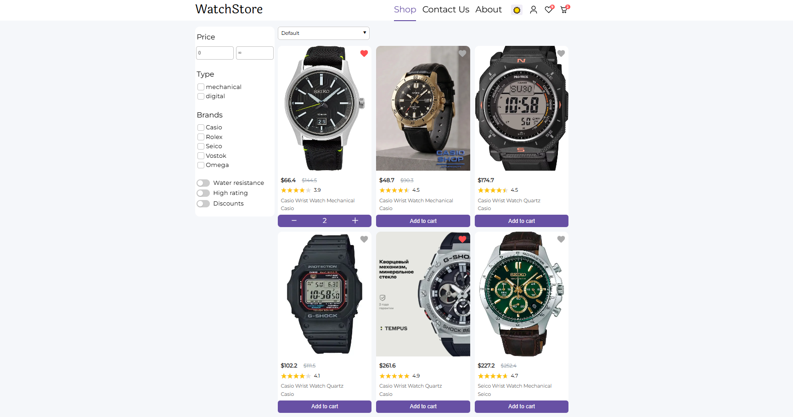

# Vue 3 Watch Shop

  

A store selling wristwatches.


- A page with a list of products.
- Product filtering occurs on the server side.
- Works with its own database.
- Registration is required to place an order and gain access to the cart.
- There is a page for each product.
- It is possible to add products to favorites.
- It is possible to change the color scheme.
- There is an adaptive design for devices up to 320px.

  




---

  

## Project Setup

  

```sh

npm install

```

  

### Compile and Hot-Reload for Development

  

```sh

npm run dev

```

  

### Compile and Minify for Production

  

```sh

npm run build

```